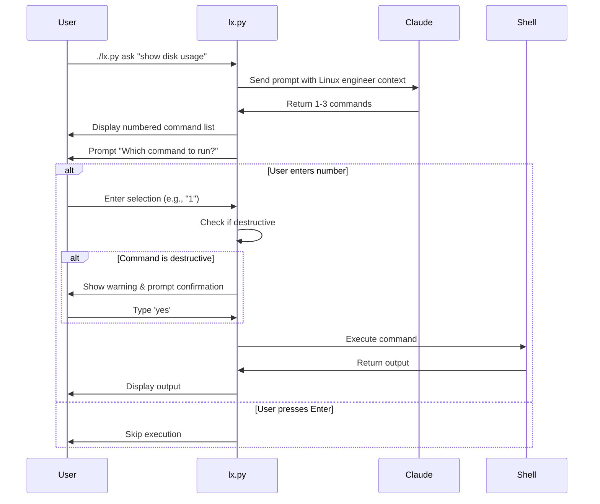
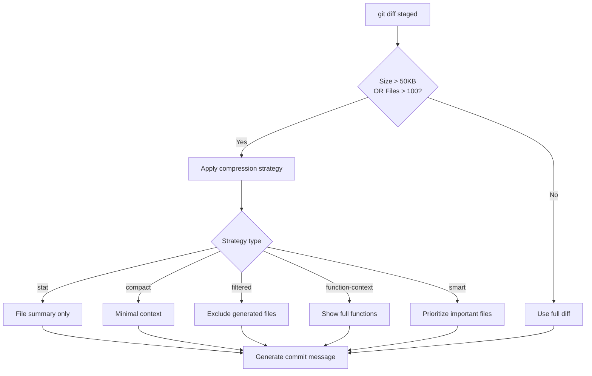

# Personal productivity scripts

## Quickstart

Requires Python >= 3.12 and [uv](https://docs.astral.sh/uv/). Scripts are executable directly:

```bash
./aca.py --help
./lx.py ask "show disk usage"
./gitlab-mr-comments.py --help
./find-related-commits.py --help
./git-switch-main.py
./git-undo --help
```

## Tools

### aca.py — AI Commit Assistant

Generate commit messages and GitLab MR descriptions using Claude. Automatically compresses large diffs to prevent prompt size errors (see [Diff Compression](#diff-compression-for-large-commits)).

- `commit` — generate a commit message from staged changes
- `mr-desc` — generate MR title/description from branch commits, create draft MR via `glab`
- `doctor` — check dependencies and authentication

```bash
./aca.py commit
./aca.py mr-desc
```

Requires: [Claude Code CLI](https://claude.ai/download) (provides authentication for Claude Agent SDK), `glab` (for `mr-desc`)

### lx.py — Linux Command Assistant

Get Linux command suggestions from Claude and execute them interactively.

**Key Features:**
- Claude-powered Linux engineer assistant (uses Sonnet by default)
- Returns 1-3 focused commands per query
- Interactive command selection and execution
- Destructive command detection with confirmation prompts

```bash
./lx.py ask "show disk usage"
./lx.py ask "list all running processes sorted by memory"
./lx.py -v ask "configure firewall to allow port 8080"
./lx.py doctor  # run diagnostic checks
```

**Example Output:**

```
❯ ./lx.py ask "check apache configuration"
Consulting Linux engineer...
1. apachectl configtest
2. apache2ctl -t
3. httpd -t
Which command to run? (number or Enter to skip):
```

**Workflow:**



**Requirements:** [Claude Code CLI](https://claude.ai/download) (provides authentication for Claude Agent SDK)

**Configuration:** Shares configuration with aca.py via `~/.config/aca/config.toml`. Model can be changed via `default_model` key or `ACA_DEFAULT_MODEL` env var.

> **Safety Notice**: The tool detects potentially destructive commands (rm, dd, mkfs, chmod, systemctl stop, etc.) and prompts for explicit confirmation before execution.

### find_related_commits.py

Find commits in a range that touched currently staged files, then optionally fixup + rebase.

```bash
git add <files>
./find-related-commits.py HEAD~10
```

### gitlab-mr-comments.py

Fetch unresolved MR discussion threads with code context (for LLM consumption).

```bash
export GITLAB_TOKEN=<token>
./gitlab-mr-comments.py --mr-url https://gitlab.com/group/project/-/merge_requests/123
```

### git-undo

Undo git commits with soft or hard reset, with safety checks to prevent data loss.

```bash
./git-undo           # soft reset last commit, keep changes staged
./git-undo 3         # soft reset last 3 commits
./git-undo --soft 2  # soft reset, unstage changes
./git-undo --hard 1  # hard reset, discard changes - prompts for confirmation
```

Note: Prevents hard reset of all commits to avoid repository corruption.

### git-switch-main.py

Intelligently switch to the main/default branch (stage/main/master) with automatic stashing.

**Features:**
- Auto-detects main branch via origin/HEAD or common names
- Caches detected branch in git config (`branch-switch.name`)
- Automatically stashes uncommitted changes (including untracked files)
- Restores stash after successful branch switch
- Creates local tracking branch if needed

```bash
./git-switch-main.py
```

Manual override: `git config branch-switch.name <branch>`

Requires: Python >= 3.12, uv, GitPython, Rich

## Architecture: Claude SDK vs API

`aca.py` and `lx.py` use the **Claude Agent SDK** (`claude-agent-sdk` Python package) instead of the direct Claude REST API. This architectural decision prioritizes developer experience and authentication simplicity, with workarounds implemented for SDK limitations.

### Why Claude SDK?

| Aspect | Claude SDK (Current) | Direct API |
|--------|---------------------|------------|
| **Authentication** | ✅ Handled by Claude Code CLI (seamless) | ❌ Requires API key management |
| **Integration** | ✅ Simple Python async/await with streaming | ⚠️ Manual HTTP requests, response parsing |
| **Streaming** | ✅ Native streaming support via async iterator | ⚠️ Requires SSE handling |
| **Prompt Delivery** | ❌ Command-line arguments (ARG_MAX limited) | ✅ HTTP body (no size limits) |
| **Dependencies** | ⚠️ Requires Claude Code CLI installation | ✅ Only HTTP client library |
| **Cost** | ✅ Included with Claude subscription (no per-request charges) | ❌ Pay-per-token via API pricing |

**Verdict**: The SDK's authentication, streaming benefits, and **cost efficiency** outweigh the ARG_MAX limitation, which is solved through intelligent workarounds. Claude subscription holders get unlimited SDK usage at no additional cost, while direct API usage incurs per-token charges.

### Solving the ARG_MAX Limitation

The primary drawback of the SDK is that prompts are passed via command-line arguments, which are subject to OS limits (typically 128KB-2MB). For large diffs, this causes "Argument list too long" errors. `aca.py` implements a **two-pronged solution**:

#### 1. Diff Compression (Preventive)
Automatically reduces diff size before sending to Claude. Five strategies available (stat, compact, filtered, function-context, smart). See [Diff Compression for Large Commits](#diff-compression-for-large-commits) for configuration details.

**Example**: A 500KB diff with 200 files can be compressed to ~50KB using the "smart" strategy, keeping full context for the 15 most important files.

#### 2. File-Based Prompt Delivery (Fallback)
When prompts exceed 50KB (configurable), the diff content is written to a temporary file in `.aca/tmp/`. Claude receives a modified prompt referencing the file path instead of the full content. The temp file is automatically cleaned up after generation. See [Large Prompt Handling](#large-prompt-handling) for details.

**Flow**: `git diff` → compression (if needed) → file-based delivery (if still large) → Claude SDK → commit message

This dual approach ensures reliable operation even with massive refactors (1000+ files), while maintaining commit message quality through intelligent prioritization.

### Cost Comparison

For developers with a Claude subscription, the SDK approach is significantly more economical:

| Scenario | Claude SDK | Direct API | Savings |
|----------|-----------|-----------|---------|
| **10 commits/day** | $0 (included) | ~$0.30/day | 100% |
| **50 commits/day** | $0 (included) | ~$1.50/day | 100% |
| **100 commits/day** | $0 (included) | ~$3.00/day | 100% |
| **Monthly (30 days, 50 commits/day)** | $0 (included) | ~$45/month | 100% |

**Key insight**: Claude subscription includes unlimited SDK usage. Direct API access charges per token (~$0.003 per 1K input tokens, ~$0.015 per 1K output tokens). A typical commit message generation uses 500-2000 input tokens and 100-300 output tokens, costing $0.002-$0.005 per commit.

**Bottom line**: If you already have a Claude subscription, the SDK approach is free. If you don't, the subscription cost ($20/month) is offset after ~7000 commits using the direct API.

## Skipping Pre-commit Hooks

The `aca.py commit` command runs pre-commit hooks on staged files before committing. This ensures code passes validation before the commit is created.

To bypass pre-commit hooks temporarily, set the `SKIP_PRECOMMIT` environment variable:

```bash
SKIP_PRECOMMIT=1 ./aca.py commit
```

**Behavior:** When `SKIP_PRECOMMIT` is set, hooks are completely bypassed:
- Pre-commit validation phase is skipped (before generating the commit message)
- The `--no-verify` flag is added to `git commit` to skip hooks during the commit phase

This ensures consistent hook-skipping behavior across both validation phases, preventing the scenario where hooks are skipped during validation but still run during commit.

**Use cases:**
- CI environments where hooks are run separately
- Emergency fixes when hooks are temporarily broken
- When hooks are known to pass but you want to skip re-running them

**Warning:** Use sparingly to maintain code quality. Pre-commit hooks help catch issues early.

## Diff Compression for Large Commits

> **Note**: See [Architecture: Claude SDK vs API](#architecture-claude-sdk-vs-api) for context on why compression is necessary.

When generating commit messages, `aca.py commit` automatically compresses large diffs that exceed configurable thresholds (default: 50KB or 100+ files). This prevents prompt size errors with the Claude API while still providing meaningful context for accurate commit message generation.

### How It Works

1. **Automatic detection**: When staged changes exceed size or file count thresholds, compression activates automatically
2. **User notification**: You'll see compression statistics showing original vs. compressed size
3. **Configurable**: Control compression via config file, environment variables, or CLI flags

### Compression Strategies

| Strategy | Description | Best For |
|----------|-------------|----------|
| `stat` | Most aggressive—shows only file names and change counts | Massive refactors (200+ files) |
| `compact` | Minimal context with 1 line around changes instead of 3 | Balanced size reduction |
| `filtered` | Excludes generated files, lockfiles, minified JS, binary files | Projects with many dependencies |
| `function-context` | Shows complete functions/classes where changes occurred | Preserving code review context |
| `smart` (default) | Intelligent file prioritization—full diff for top 15 important files, stat-only for others | Most use cases |

### Configuration

Add to `~/.config/aca/config.toml`:

```toml
[aca]
diff_compression_enabled = true
diff_compression_strategy = "smart"
diff_size_threshold_bytes = 50000  # 50KB
diff_files_threshold = 100
diff_max_priority_files = 15       # For smart strategy
diff_token_limit = 100000          # Character limit
diff_smart_priority_enabled = true
```

### Environment Variables

Override configuration with environment variables:

| Variable | Description |
|----------|-------------|
| `ACA_DIFF_COMPRESSION_ENABLED` | Enable/disable compression (true/false/1/0) |
| `ACA_DIFF_COMPRESSION_STRATEGY` | Strategy name (stat/compact/filtered/function-context/smart) |
| `ACA_DIFF_SIZE_THRESHOLD` | Size threshold in bytes |
| `ACA_DIFF_FILES_THRESHOLD` | File count threshold |
| `ACA_DIFF_MAX_PRIORITY_FILES` | Max priority files for smart strategy |
| `ACA_DIFF_TOKEN_LIMIT` | Character limit |
| `ACA_DIFF_SMART_PRIORITY_ENABLED` | Enable smart prioritization (true/false) |

### Command-Line Flags

```bash
./aca.py commit --no-compress      # Disable compression for this commit
./aca.py commit --show-prompt      # Display full prompt before sending
```

### Example Usage

```bash
# Use stat strategy for massive refactors
ACA_DIFF_COMPRESSION_STRATEGY=stat ./aca.py commit

# Increase priority files for more detailed commits
ACA_DIFF_MAX_PRIORITY_FILES=25 ./aca.py commit

# Debug compression issues
./aca.py commit --show-prompt --no-compress
```

### Troubleshooting

| Problem | Solution |
|---------|----------|
| Commit message lacks detail | Try `function-context` strategy or increase `diff_max_priority_files` |
| Still getting prompt too large errors | Use `stat` strategy or reduce `diff_token_limit` |
| Compression too aggressive | Increase `diff_size_threshold_bytes` or use `--no-compress` |
| "Argument list too long" error | Enable file-based delivery: `ACA_PROMPT_FILE_ENABLED=true`. This works around SDK ARG_MAX limits (see [Architecture](#architecture-claude-sdk-vs-api)) |
| Want to test compression settings | Run `./aca.py doctor` to validate config and simulate compression |

### Compression Decision Flow



### Large Prompt Handling

> **Note**: This feature works around ARG_MAX limitations of the Claude SDK. See [Architecture](#architecture-claude-sdk-vs-api) for details.

Even with compression, some diffs may be too large to pass via command-line arguments due to OS limitations (ARG_MAX). `aca.py` automatically handles this using **file-based prompt delivery**.

#### How It Works

1. **Automatic detection**: When the prompt exceeds 50KB (configurable), the diff is written to a temporary file
2. **Modified prompt**: Claude receives a smaller prompt that references the temp file path
3. **Automatic cleanup**: The temp file is deleted after generation completes

#### Configuration

| Variable | Description | Default |
|----------|-------------|---------|
| `ACA_PROMPT_FILE_ENABLED` | Enable/disable file-based delivery | `true` |
| `ACA_PROMPT_FILE_THRESHOLD` | Size threshold in bytes | `50000` (50KB) |

Or in `~/.config/aca/config.toml`:

```toml
prompt_file_enabled = true
prompt_file_threshold_bytes = 50000
```

#### Troubleshooting "Argument list too long" Errors

| Problem | Solution |
|---------|----------|
| "Argument list too long" error | Enable file-based delivery: `ACA_PROMPT_FILE_ENABLED=true` |
| Error persists with file delivery | Use more aggressive compression: `ACA_DIFF_COMPRESSION_STRATEGY=stat` |
| Temp directory issues | Check permissions: `./aca.py doctor` will test temp directory |
| Want to lower threshold | Set `ACA_PROMPT_FILE_THRESHOLD=30000` for earlier file-based delivery |

**Note**: File-based delivery requires Claude to read from the temp file. If you encounter issues, check:
- Temp directory is writable (`./aca.py doctor`)
- Claude Code CLI has access to the temp directory
- Sufficient disk space in temp directory

